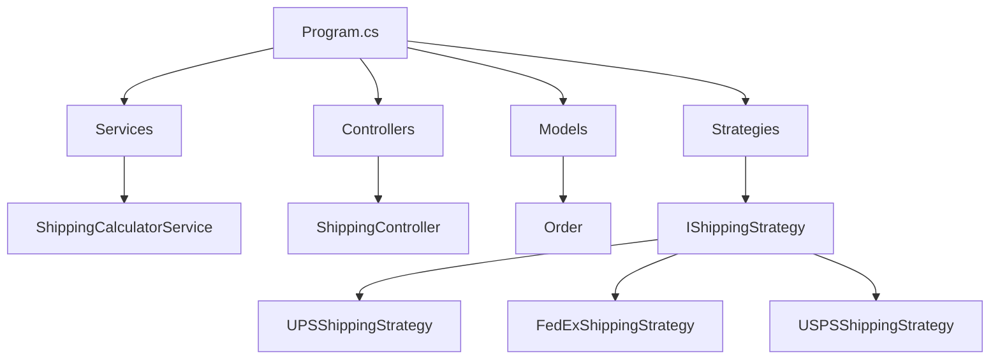

# ShippingCalculator - Strategy Pattern

This project is a refactor of a Shipping Calculator using the **Strategy Pattern**.  
It was implemented as an **ASP.NET Core Web API** to demonstrate clean architecture, extensibility, and maintainability.

## Features
- Implements the Strategy Pattern for shipping cost calculation.
- Supports multiple shipping methods (UPS, FedEx, USPS).
- Easy to extend: add new strategies without modifying existing code.
- Exposed via Web API endpoints for real-world usage.

## Tech Stack
- ASP.NET Core 6 Web API
- C#
- SQL Server (for persistence, optional)
- Swagger (for testing endpoints)

## Project Structure



##  How to Run
1. Clone the repository:
   ```bash
   git clone https://github.com/IsaStart/ShippingCalculator-StrategyPattern.git
   cd ShippingCalculator-StrategyPattern
   ```
Restore dependencies:
```bash
dotnet restore
```

Run the API:
```bash
dotnet run
```

Open Swagger UI in your browser:
https://localhost:5106/swagger

Example Request
POST /api/shipping/calculate

```json
{
  "TotalWeight": 10,
  "ShippingMethod": "UPS"
}
```
Example Response
```json
{
  "ShippingMethod": "UPS",
  "Cost": 5.0
}
```
